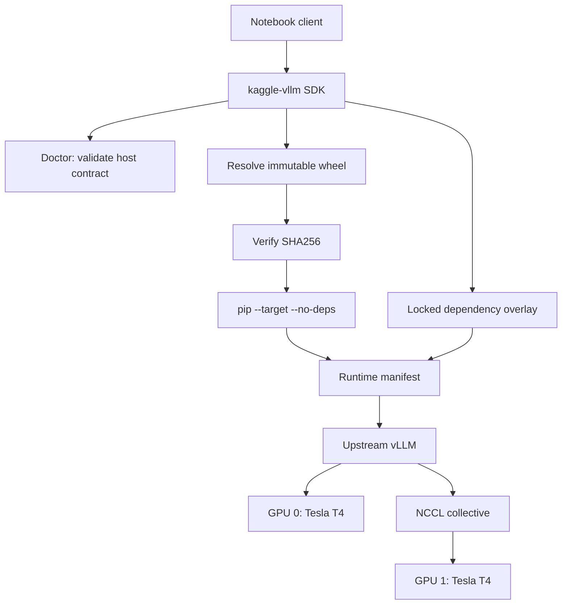

## Problem

The engineering question behind `kaggle-vllm` is narrow:

> How can an upstream vLLM CUDA runtime be delivered into a managed Kaggle notebook without silently replacing the Python, PyTorch, or CUDA stack that the notebook already provides?
{: .prompt-info }

This is not primarily an API-design problem. It is a compatibility and provenance problem. A native inference runtime sits at the intersection of the Python ABI, PyTorch, CUDA, the NVIDIA driver, NCCL, compiled extensions, GPU architecture, and model representation. If any layer drifts, a command that looks like a normal package installation can produce an environment that imports incorrectly—or one that imports but no longer matches the system that was tested.

The public [`kaggle-vllm` README](https://github.com/kaggle-vllm/kaggle-vllm/blob/39f194eebf56c44e0f56bff54c1123a41725c049/README.md#L15-L29) defines the response: validate the host, resolve an immutable runtime artifact, verify its checksum, stage it without dependency resolution, and keep the dependency overlay separate. The project explicitly does **not** claim to be a vLLM fork or a new inference engine.

## Why it matters

Managed GPU environments are productive precisely because much of the stack is already installed. That convenience creates a constraint: replacing one low-level dependency can invalidate the rest of the image.

For inference engineering, reproducibility requires more than saving a notebook. A useful experiment must answer:

- Which exact source revision produced the runtime?
- Which Python and CUDA ABI was the wheel built for?
- Which host libraries remained in place?
- Which GPUs and topology were visible?
- Which configuration was requested?
- Where are the logs and machine-readable results?

Without those identities, a successful output string is evidence only that *something* ran. It is not enough to compare tensor-parallel configurations, diagnose a collective, or reproduce a regression.

## Environment

The first strong compatibility claim is intentionally limited to the committed profile below. These values come from the repository’s [machine-readable compatibility manifest](https://github.com/kaggle-vllm/kaggle-vllm/blob/39f194eebf56c44e0f56bff54c1123a41725c049/compat/kaggle-t4x2-cu128.json#L1-L34), not from assumptions about Kaggle or T4 systems in general.

| Component | Validated value |
|---|---|
| GPU | 2 × NVIDIA Tesla T4 |
| GPU architecture | compute capability 7.5 / SM75 |
| CUDA toolkit | 12.8.93 |
| NVIDIA driver | 580.159.04 |
| Python | CPython 3.12.13 / cp312 |
| PyTorch | 2.10.0+cu128 |
| NCCL | 2.27.5 |
| vLLM source | v0.18.1 at `a26e8dc7ff2111a005144d775ecf9cebf56c45b2` |

The table is a compatibility boundary, not a promise that every notebook image, T4 host, CUDA release, or vLLM version behaves identically.

## Architecture

The delivery path separates validation, immutable resolution, native staging, and activation:



This is a boundary-of-responsibility diagram. The SDK owns validation, artifact resolution, checksum verification, safe staging, activation, and thin wrappers. Upstream vLLM remains responsible for kernels, scheduling, model execution, tensor parallelism, and serving. The same separation is documented in the repository’s [architecture note](https://github.com/kaggle-vllm/kaggle-vllm/blob/39f194eebf56c44e0f56bff54c1123a41725c049/docs/architecture.md#L26-L46).

## Hypothesis

The working hypothesis was that a compatibility layer could preserve the managed base image while making the runtime identity explicit:

1. Refuse unsupported host identities instead of guessing.
2. Pin the native artifact by immutable revision and SHA256.
3. Stage the native wheel with dependency resolution disabled.
4. Put missing Python dependencies in a separate overlay.
5. Activate paths explicitly and record them in a manifest.

This design does not predict throughput. It only creates the conditions under which later performance experiments can be interpreted.

## Relevant implementation

The public dual-GPU example is deliberately small. The selected excerpt below is from [`examples/dual_t4_tp2.py`](https://github.com/kaggle-vllm/kaggle-vllm/blob/39f194eebf56c44e0f56bff54c1123a41725c049/examples/dual_t4_tp2.py#L3-L16) at the source commit recorded in this article.

```python
from vllm import SamplingParams
from kaggle_vllm import KaggleLLM

llm = KaggleLLM(
    model="facebook/opt-125m",
    tensor_parallel_size=2,
    max_model_len=512,
    gpu_memory_utilization=0.40,
)
outputs = llm.generate(
    ["NCCL is used by distributed GPU applications to"],
    SamplingParams(temperature=0.0, max_tokens=32),
)
```

The code is not presented as a performance result. It shows the minimum configuration surface for a dual-device smoke run.

The corresponding compatibility identity is data, not prose:

```json
{
  "profile_id": "kaggle-py312-torch210-cu128-sm75-t4x2",
  "python": "3.12.13",
  "torch": "2.10.0+cu128",
  "cuda_toolkit": "12.8.93",
  "gpus": 2,
  "gpu_name": "Tesla T4",
  "compute_capability": "7.5"
}
```

The publishing workflow records the same provenance declaratively:

```yaml
source:
  repository: kaggle-vllm/kaggle-vllm
  ref: 39f194eebf56c44e0f56bff54c1123a41725c049
code:
  - file: examples/dual_t4_tp2.py
    lines: "3:16"
    language: python
```

## Experiment

The first experiment is operational rather than comparative: prove that the environment, artifact, and activation path agree before asking a performance question.

The repository documents this sequence:

```bash
python -m pip install "kaggle-vllm[hub]==0.2.0"
kaggle-vllm bootstrap --strict --dry-run
kaggle-vllm bootstrap --strict
eval "$(kaggle-vllm env)"
kaggle-vllm doctor --strict
```

The dry run matters. It exposes the selected profile and paths before the runtime is downloaded or staged. The strict doctor then turns profile drift into an error rather than quietly broadening the project’s claim.

For later benchmark articles, the experiment record must preserve engine settings, workload settings, token counts, timing mode, topology output, telemetry availability, and limitations. The committed [benchmark schema](https://github.com/kaggle-vllm/kaggle-vllm/blob/39f194eebf56c44e0f56bff54c1123a41725c049/docs/benchmarking.md#L89-L124) provides those sections.

## Results

This introductory article does not publish a new benchmark. Its result is a traceable publication boundary:

| Question | Evidence required before a claim is published |
|---|---|
| Did the intended runtime load? | strict doctor output, import path, artifact hash |
| Did both GPUs participate? | visible-device record, worker/rank logs, NCCL evidence |
| Was TP=2 faster? | controlled TP=1/TP=2 results with matched non-TP settings |
| Did topology matter? | captured topology plus an experiment that isolates the variable |
| Can another engineer reproduce it? | immutable source, exact commands, raw JSON/logs, limitations |

> No new latency, throughput, memory, or speedup number is claimed here. Later articles will ingest measurements from committed JSON or CSV artifacts rather than transcribing them by hand.
{: .prompt-warning }

## Interpretation

The useful output of this stage is not “dual GPU is faster.” It is a system in which that question can be tested without losing track of the runtime.

Tensor parallelism introduces communication as well as compute. Whether it helps depends on the model, batch and concurrency regime, partitioning, kernel path, topology, and collective cost. That is why the publication roadmap separates:

- basic dual-device correctness;
- tensor-parallel performance;
- measured NCCL/topology behavior;
- concurrency crossover;
- multi-node orchestration;
- pipeline parallelism.

Each is a different experiment, not a chapter in a predetermined success story.

For a decoder-only transformer, a useful planning equation for KV-cache storage is:

$$
KV_{bytes} = 2 \times L \times H_{kv} \times D_h \times B_e \times S
$$

where $L$ is the layer count, $H_{kv}$ the number of KV heads, $D_h$ the head dimension, $B_e$ bytes per element, and $S$ the sequence length. The factor of two accounts for keys and values. The equation is a capacity model; an experiment must still measure allocator behavior and runtime overhead for a specific engine configuration.

## What failed

The design exists because the naive installation model is unsafe for this environment. The project architecture notes that a normal dependency-resolving vLLM installation may select a different Torch/CUDA set and disturb the managed image ([source](https://github.com/kaggle-vllm/kaggle-vllm/blob/39f194eebf56c44e0f56bff54c1123a41725c049/docs/architecture.md#L3-L8)).

Another failure mode is epistemic: treating a generated response as a benchmark. A smoke test can establish basic execution. It cannot establish throughput, TTFT, TPOT, scaling efficiency, or the cause of a performance difference.

## Limitations

- The compatibility profile is specific to the environment recorded above.
- A two-GPU smoke run is not a production-readiness test.
- Successful NCCL execution does not by itself characterize collective bandwidth.
- This article does not compare NVIDIA T4 with another accelerator.
- The KV-cache equation omits engine-specific allocation and fragmentation effects.
- The article introduces the evidence model but does not add a new measured result.

## Reproduction

To inspect the exact source used for this article without touching another checkout:

```bash
git clone https://github.com/kaggle-vllm/kaggle-vllm.git
cd kaggle-vllm
git checkout 39f194eebf56c44e0f56bff54c1123a41725c049
git status --short
python -m pytest
```

GPU acceptance must run only in the documented environment and should write evidence to a new, inspected output directory. CPU tests validate tooling behavior; they do not substitute for GPU evidence.

## Evidence

- [Source repository at commit `39f194e`](https://github.com/kaggle-vllm/kaggle-vllm/tree/39f194eebf56c44e0f56bff54c1123a41725c049)
- [Compatibility manifest](https://github.com/kaggle-vllm/kaggle-vllm/blob/39f194eebf56c44e0f56bff54c1123a41725c049/compat/kaggle-t4x2-cu128.json)
- [Architecture and responsibility boundary](https://github.com/kaggle-vllm/kaggle-vllm/blob/39f194eebf56c44e0f56bff54c1123a41725c049/docs/architecture.md)
- [Benchmark methodology and evidence schema](https://github.com/kaggle-vllm/kaggle-vllm/blob/39f194eebf56c44e0f56bff54c1123a41725c049/docs/benchmarking.md)
- [Public releases](https://github.com/kaggle-vllm/kaggle-vllm/releases)

## Next experiment

The next note will ask a controlled question: **under a fixed model and workload, what changes when tensor parallel size moves from one to two on the documented dual-T4 host?**

It will require matched engine settings, isolated runs, raw timing evidence, topology capture, and a clear distinction between capacity and performance.
