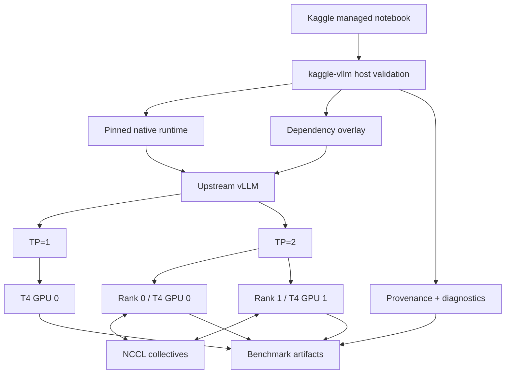
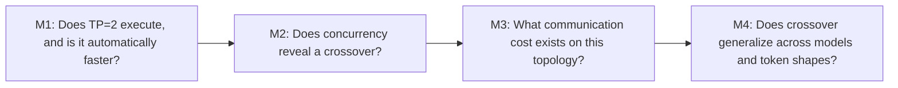
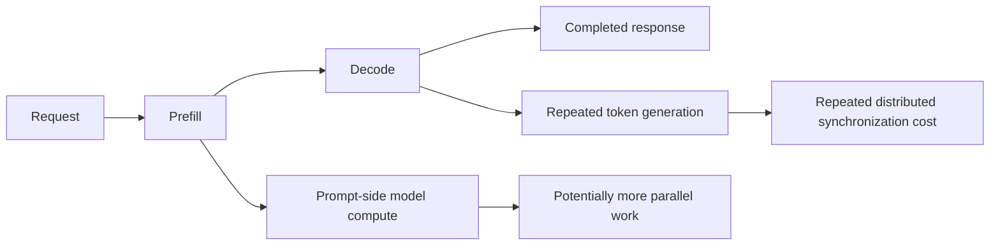
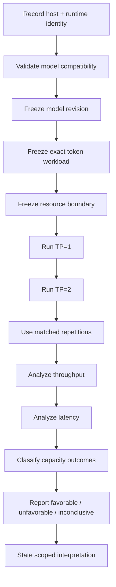

## From a compatibility project to a research question

I originally built [`kaggle-vllm`](https://github.com/kaggle-vllm/kaggle-vllm) to solve a practical systems problem:

> How can upstream vLLM be delivered reproducibly into Kaggle's managed dual-NVIDIA-T4 environment without silently replacing the Python, PyTorch, CUDA, or NCCL stack that the notebook already provides?
{: .prompt-info }

That problem led to compatibility manifests, pinned runtime artifacts, checksum verification, safe runtime staging, environment diagnostics, NCCL validation, tensor-parallel smoke tests, model compatibility work, and reproducible benchmark tooling.

But once two-GPU inference was working, a more interesting question appeared.

**Was the second GPU actually helping performance?**

The answer was not automatically yes.

Sometimes TP=2 was slower than TP=1.

At higher concurrency, TP=2 could become faster.

For longer prompt-side workloads, the crossover could happen much earlier.

For one model and workload, the tested range could end without a sustained TP=2 win.

And at the edge of the memory envelope, a configuration could stop being a valid performance comparison at all.

Those observations became the basis of my research paper:

> **Characterizing Tensor-Parallel Crossover in vLLM Serving on Dual NVIDIA Tesla T4 GPUs**

The paper is publicly available as a Zenodo preprint:

- **Paper:** [Zenodo record 23119478](https://zenodo.org/records/23119478)
- **DOI:** [10.5281/zenodo.23119478](https://doi.org/10.5281/zenodo.23119478)
- **Software:** [kaggle-vllm](https://github.com/kaggle-vllm/kaggle-vllm)

This article is the engineering interpretation of that paper: what I measured, why I designed the experiments the way I did, which claims the evidence supports, and what I would like other researchers and inference engineers to reproduce next.

---

## The central idea: TP=2 has a crossover, not a guarantee

Tensor parallelism divides model computation across multiple GPUs. At first glance, it is natural to expect that using two GPUs should make inference faster than using one.

But distributed inference introduces costs that single-GPU inference does not pay.

A simplified model is:

$$
T_{TP2}
=
T_{compute,distributed}
+
T_{communication}
+
T_{synchronization}
+
T_{scheduler}
+
T_{runtime}
$$

while a comparable single-GPU path is closer to:

$$
T_{TP1}
=
T_{compute,single}
+
T_{scheduler}
+
T_{runtime}
$$

The second GPU can reduce some compute pressure or increase useful parallel work, but it also introduces collective communication, rank synchronization, distributed execution overhead, and additional scheduling complexity.

The question is therefore not:

> **Can TP=2 run?**

The performance question is:

> **Under which model, token-shape, concurrency, topology, and resource conditions does the useful parallel work become large enough to overcome the extra distributed cost?**
{: .prompt-info }

That point is what I call the **tensor-parallel crossover**.

---

## Four questions that should not be collapsed into one

A major lesson from this project is that multi-GPU inference has at least four separate evaluation dimensions:

| Dimension | Question |
|---|---|
| **Compatibility** | Can the runtime, model, kernels, and device configuration initialize and execute correctly? |
| **Capacity** | Does the requested model, context, batch, and concurrency fit inside the resource envelope? |
| **Performance** | For valid configurations, how do throughput and latency compare? |
| **Quality** | Are the generated outputs useful, correct, or linguistically strong? |

These are related, but they are not interchangeable.

A TP=2 setup may be **compatible** and still be slower.

TP=2 may provide **capacity** for a workload that cannot fit on TP=1 while providing no throughput advantage.

A configuration can become **resource-gated**, meaning no valid performance result exists for that cell.

A bilingual model may successfully generate Arabic and English text without that execution test proving **language quality**.

I therefore use the following principle throughout the paper:

> **A working TP=2 configuration and a TP=2 performance win are different observations.**
{: .prompt-warning }

This distinction sounds simple, but it changes how benchmark evidence should be interpreted.

---

## Experimental platform

The principal experiments were conducted on Kaggle's dual NVIDIA Tesla T4 environment.

The recorded benchmark identity used in the research included:

| Component | Experimental identity |
|---|---|
| GPUs | 2 × NVIDIA Tesla T4 |
| Architecture | Turing, compute capability 7.5 / SM75 |
| Device memory | 15,360 MiB per GPU |
| Observed topology | PHB |
| Python | CPython 3.12.13 |
| PyTorch | 2.10.0+cu128 |
| CUDA toolkit | 12.8.93 |
| Torch CUDA | 12.8 |
| NCCL | 2.27.5 |
| Historical NVIDIA driver | 580.159.04 |
| Serving runtime | pinned upstream-vLLM-derived CUDA runtime |

The **PHB topology** is important.

These are not NVLink-connected accelerators. Tensor-parallel ranks must exchange data across the observed host bridge path, so communication cost is part of the system being characterized.

The paper therefore does **not** claim that a crossover measured on this platform transfers unchanged to:

- NVIDIA L4;
- A10/A10G;
- A100;
- H100;
- NVLink-connected systems;
- four-GPU configurations;
- multi-node deployments;
- newer or older vLLM releases.

The results belong to a specific measured system.

That is a feature, not a weakness: reproducible systems work should be explicit about its boundary conditions.

---

## Why `kaggle-vllm` matters to the experiment

[`kaggle-vllm`](https://github.com/kaggle-vllm/kaggle-vllm) is not a fork of vLLM and does not replace the upstream inference engine.

It does not reimplement:

- PagedAttention;
- the vLLM scheduler;
- tensor parallelism;
- NCCL;
- model kernels;
- distributed worker execution.

Instead, it provides the compatibility and evidence boundary around the environment.

A simplified architecture is:



The purpose of this separation is reproducibility.

A performance number is much less useful if the runtime identity, Python ABI, Torch build, CUDA version, model revision, topology, and benchmark configuration are uncertain.

The toolkit creates the conditions under which an upstream-vLLM performance result can be interpreted.

---

## Why I did not begin with a giant benchmark matrix

The research progressed in stages.

Each stage answered a narrower question before the next one was allowed to make a stronger claim.

Conceptually:



This progression was deliberate.

If M1 had already shown a universal TP=2 win, a larger crossover experiment might have looked very different.

Instead, the early experiments showed that **operational multi-GPU execution was not enough to infer a performance benefit**.

---

## M1: TP=2 worked, but TP=1 was faster

The first diagnostic stage used OPT-125M.

This was not meant to characterize production-scale serving. It was a controlled low-load test of whether dual-GPU execution itself implied a speedup.

It did not.

For graph-mode execution, the five-trial mean output throughput was approximately:

| Configuration | Mean output throughput |
|---|---:|
| TP=1 | 1921.42 tokens/s |
| TP=2 | 1408.55 tokens/s |

For eager execution:

| Configuration | Mean output throughput |
|---|---:|
| TP=1 | 312.19 tokens/s |
| TP=2 | 172.33 tokens/s |

Both GPUs participated.

The distributed runtime executed.

Yet the second GPU reduced output throughput in this low-load regime.

This result is important because it eliminates one tempting shortcut:

```text
two GPUs active
    ≠
two GPUs faster
```

M1 therefore changed the research direction.

Instead of asking whether tensor parallelism "works," I began asking **when its overhead becomes worth paying**.

---

## M2: concurrency exposed a visible crossover

The exploratory M2 experiment used **Qwen2.5-3B-Instruct** and varied request concurrency across:

```text
1, 4, 8, 16, 32, 64
```

The observed output-throughput measurements were:

| Concurrency | TP=1 output tok/s | TP=2 output tok/s |
|---:|---:|---:|
| 1 | 26.29 | 14.95 |
| 4 | 76.87 | 55.21 |
| 8 | 108.53 | 99.80 |
| 16 | 138.75 | 174.27 |
| 32 | 158.65 | 267.79 |
| 64 | 177.82 | 311.94 |

The qualitative pattern was clear.

At low concurrency:

$$
Throughput_{TP1} > Throughput_{TP2}
$$

At higher concurrency:

$$
Throughput_{TP2} > Throughput_{TP1}
$$

The second GPU appeared to become useful once enough concurrent work was available to amortize its distributed overhead.

But M2 was intentionally treated as **exploratory**.

A single serving matrix can reveal a pattern, but it is not strong enough to establish a general threshold.

That distinction becomes important later, because the more rigorous M4 experiment produced a different inferential crossover for the Qwen balanced workload.

---

## A useful mathematical view of the crossover

Let:

$$
G(C) = T_{TP2}(C) - T_{TP1}(C)
$$

where $T$ represents measured output throughput and $C$ represents offered concurrency.

Then:

- if $G(C) < 0$, TP=1 is faster;
- if $G(C) > 0$, TP=2 is faster;
- if uncertainty spans both sides, the evidence is inconclusive;
- if the configuration is resource-gated, there is no valid performance comparison.

A crossover occurs when the measured advantage moves into a sustained favorable TP=2 regime.

The word **sustained** matters.

I did not want a single noisy point to become the headline conclusion.

---

## M3: measure communication without pretending it explains everything

If TP=2 is paying extra overhead, NCCL communication is an obvious component to investigate.

But there is a methodological trap here.

It is easy to observe a communication benchmark and then over-attribute serving behavior to it.

To avoid that, M3 measured NCCL separately and kept its claim narrow.

The experiment used:

- two NCCL ranks;
- the same class of PHB-connected T4 platform;
- ten payload sizes;
- five fresh-process repetitions per payload;
- 100 timed collectives per repetition.

That produced:

**5,000 critical-path observations.**

The fitted all-reduce model was:

$$
T_{\mu s}(S)
=
112.135079
+
\frac{S}{4.063916\ \mathrm{GB/s}}
$$

with approximately:

- **112.14 μs fitted intercept**
- **4.06 GB/s fitted effective bandwidth**

At a 64 MiB payload, measured effective payload bandwidth was approximately:

**4.03 GB/s**.

This establishes that the tested topology has a measurable communication cost.

It does **not** prove that NCCL alone caused a particular serving slowdown.

A complete causal decomposition would need deeper instrumentation of:

- model compute;
- collective timing;
- scheduling;
- synchronization;
- kernel launch behavior;
- memory management;
- batch formation;
- request execution.

So M3 is best understood as **system context**, not a complete explanation.

---

## M4: the principal experiment

M4 is the main experiment in the paper.

Instead of testing one model under one request shape, it varies three important dimensions:

```text
model
×
exact token workload
×
concurrency
```

The principal serving-ready model families were:

- **Qwen2.5-3B-Instruct**
- **Llama-3.2-3B-Instruct**
- **Phi-4-mini-instruct**
- **Ministral-3-3B-Instruct**

The concurrency grid was:

```text
1, 4, 8, 16, 32, 64
```

Each model/workload combination used **five matched logical repetitions**.

The full design contained:

- **60 terminal logical shards**
- **720 planned fresh-server cells**
- **55 canonical performance outcomes**
- **5 resource-boundary outcomes**

The resource-gated outcomes were kept in the final evidence rather than discarded.

---

## Exact token shapes instead of vague "short" and "long" prompts

One important design choice was to define workloads by exact input/output token counts.

### Short / decode-heavy

```text
Input tokens:   128
Output tokens:   64
```

### Balanced

```text
Input tokens:   512
Output tokens:  256
```

### Prefill-heavy

```text
Input tokens:   2048
Output tokens:   128
```

This makes the experiment much easier to interpret.

A phrase like "long prompt" can describe very different token counts.

Exact token shapes give us a controlled way to change the relative amount of prompt processing and autoregressive decode work.

A simplified serving path is:



The experiment does not claim this diagram is a complete causal model.

It is a useful way to understand why workload shape might change the point at which TP=2 becomes worthwhile.

---

## The primary crossover result

The paper uses matched repetitions and a predeclared 95% confidence-interval decision rule to identify the first **sustained favorable TP=2 output-throughput point** within the tested grid.

The result is:

| Model | Balanced | Prefill-heavy | Short |
|---|---:|---:|---:|
| **Qwen2.5-3B** | 64 | resource-gated at 64 | none |
| **Phi-4-mini** | 32 | 4 | 64 |
| **Ministral-3-3B** | 16 | 4 | 32 |
| **Llama-3.2-3B** | 16 | 4 | 32 |

This table is the core result of the paper.

It shows that there is no meaningful universal statement such as:

```text
"TP=2 wins after concurrency 16."
```

The threshold moves with the model and workload.

The more accurate statement is:

> **The tensor-parallel crossover is jointly determined by model family, token shape, offered concurrency, runtime behavior, topology, and resource limits.**
{: .prompt-info }

---

## Prefill-heavy workloads crossed earlier

One of the strongest patterns in M4 appears in the prefill-heavy workload.

For:

- Llama-3.2-3B;
- Phi-4-mini;
- Ministral-3-3B;

the first sustained favorable TP=2 point occurred at:

**concurrency 4**.

Their balanced workloads crossed later.

Their short workloads crossed later still.

This is consistent with the idea that heavier prompt-side computation can expose enough useful parallel work for TP=2 to amortize distributed overhead earlier.

But the paper is careful about the wording.

The experiment directly observes the crossover pattern.

It does not instrument every kernel and collective deeply enough to prove the complete causal mechanism.

That difference between **observation** and **mechanistic attribution** matters in systems research.

---

## Short workloads were much less favorable to TP=2

For the short workload:

```text
128 input tokens
64 output tokens
```

the second GPU was harder to justify from an output-throughput perspective.

The first sustained favorable points were:

- **Llama-3.2-3B:** C=32
- **Ministral-3-3B:** C=32
- **Phi-4-mini:** C=64
- **Qwen2.5-3B:** no sustained favorable point in the tested range

This has a practical implication.

If a service is dominated by short, interactive requests, then a second GPU may not improve output throughput until the system is under substantial concurrent load.

That does not mean the second GPU is useless.

It may still be necessary for **capacity**.

But capacity and performance should be reported separately.

---

## Why Qwen's prefill-heavy endpoint is not "zero throughput"

The Qwen prefill-heavy experiment illustrates another important principle.

At some intermediate concurrency levels, TP=2 looked favorable.

It might therefore be tempting to extrapolate that the highest tested concurrency would remain favorable.

But at:

```text
model       = Qwen2.5-3B-Instruct
workload    = prefill-heavy
concurrency = 64
TP          = 2
```

all five matched repetitions reached the frozen per-GPU resource boundary.

The experiment's threshold was:

**14,848 MiB per physical GPU**

while the canonical sampled maximum averaged approximately:

**14,895 MiB**.

The correct terminal result is:

```text
RESOURCE_GATED
```

It is not:

```text
0 tokens/s
```

and it is not:

```text
TP=2 lost
```

No valid throughput observation exists for that terminal configuration under the experiment's fixed rules.

This distinction is more than terminology.

Assigning zero would turn a capacity outcome into a fabricated performance measurement.

---

## Resource boundaries are part of the experiment

A benchmark can become misleading if its constraints change whenever an inconvenient configuration appears.

In the resource-gated case, I did not:

- increase the memory limit;
- reduce the prompt size;
- change the model;
- lower concurrency after observing the outcome;
- discard failed repetitions;
- rerun until a favorable number appeared.

The frozen resource boundary remained part of the experiment.

That means a "failure" can be a useful result:

> under this runtime, model, workload, concurrency, and memory boundary, the requested TP configuration was outside the accepted resource envelope.

For deployment planning, that information can be as valuable as a throughput number.

---

## Throughput and latency answer different questions

The study also records client-visible latency metrics such as:

- **TTFT** — time to first token;
- **TPOT** — time per output token;
- **ITL** — inter-token latency;
- **E2E latency** — total request completion time;
- request throughput;
- output-token throughput.

These metrics should not be collapsed into a single "faster" label.

A configuration can improve total output-token throughput while worsening the experience of an individual request.

For example, a scheduler might keep more aggregate work in flight at high concurrency, improving total throughput even though single-request latency does not improve.

So:

> **Higher aggregate throughput does not automatically mean lower user-visible latency.**
{: .prompt-warning }

Similarly:

> **More usable aggregate VRAM does not automatically mean higher throughput.**
{: .prompt-warning }

And:

> **More GPUs do not automatically mean better serving performance.**
{: .prompt-warning }

---

## The crossover is better understood as a surface

At the beginning of this project, I thought about finding "the" tensor-parallel crossover.

The results suggest a better model.

Let TP benefit be:

$$
B = f(M, W, C, R, H, E)
$$

where:

- $M$ = model;
- $W$ = workload/token shape;
- $C$ = concurrency;
- $R$ = runtime and scheduler configuration;
- $H$ = hardware and interconnect topology;
- $E$ = resource envelope.

A measured crossover is therefore one slice through a multidimensional surface.

Changing any of these dimensions can move the threshold.

Examples:

- a longer prompt can increase prefill work;
- higher concurrency can expose more batching opportunity;
- a different model can change partitioned compute behavior;
- a faster interconnect can reduce collective cost;
- a new vLLM release can change kernels, scheduling, or memory behavior;
- a different memory limit can turn a performance cell into a resource-gated cell.

This is why the paper does not present one universal "TP=2 threshold."

---

## Why M2 and M4 report different Qwen crossover stories

The earlier M2 experiment showed Qwen TP=2 becoming descriptively favorable around:

**C=16**

The M4 balanced experiment identified the first **sustained** favorable point under its repeated, paired 95% confidence-interval rule at:

**C=64**.

Those findings should not be forced into one number.

They have different evidential roles.

M2 asks:

> What happened in one exploratory concurrency sweep?

M4 asks:

> What favorable point survives the frozen repeated design and the predeclared inferential rule?

The second is a stronger question.

That is why the paper keeps exploratory observations separate from the principal inference.

This is also a useful reminder that a benchmark's repetition structure can materially change how confidently a crossover should be reported.

---

## Repetition units matter

Hundreds of requests do not automatically mean hundreds of independent experimental replications.

The study distinguishes among:

```text
individual request
    ≠
fresh-server cell
    ≠
matched logical repetition
    ≠
model/workload experiment
```

For M4 crossover inference, the matched logical repetitions are the important independent comparison unit.

Treating every request inside the same server run as a completely independent reproduction would artificially inflate confidence.

This may sound like a statistical detail, but it directly affects whether a claimed TP=2 advantage is robust or just a noisy serving observation.

---

## Compatibility gating before performance

The principal experiment began with five checkpoint families entering compatibility evaluation.

Four became serving-ready for the final M4 performance matrix.

A Gemma 3 4B configuration remained a recorded negative compatibility result under the frozen FP16/SM75 condition.

I did not replace it after observing the result simply to preserve a five-model table.

That decision follows the same evidence hierarchy:

```text
compatibility
    ↓
capacity
    ↓
performance
    ↓
quality
```

A model that does not pass the experiment's compatibility gate should not quietly reappear as a performance result under altered conditions.

Negative compatibility outcomes belong in the record.

---

## Supplementary ALLaM-7B case study

The paper also includes a separate case study using:

[`humain-ai/ALLaM-7B-Instruct-preview`](https://huggingface.co/humain-ai/ALLaM-7B-Instruct-preview)

The ALLaM experiment is intentionally **not** treated as a fifth M4 model.

It is a supplementary systems case exploring bilingual Arabic/English serving behavior on the constrained dual-T4 platform.

The case study contributes evidence about:

- TP=2 execution;
- bilingual request handling;
- context and capacity behavior;
- constrained-GPU serving;
- reproducible runtime identity.

But it does not turn successful text generation into a language-quality benchmark.

The correct statement is:

```text
Arabic/English generation executed successfully
```

not:

```text
the experiment proved Arabic linguistic quality
```

Again:

> **Execution compatibility is not model quality.**
{: .prompt-warning }

This distinction becomes especially important when systems papers include model outputs as operational evidence.

---

## Why I kept negative results

A benchmark becomes less trustworthy when inconvenient outcomes disappear from the final story.

I deliberately retained results that complicate the simple claim that "more GPUs are better."

The research preserves:

- TP=1 wins;
- TP=2 wins;
- points without a sustained favorable result;
- resource-gated configurations;
- a negative model compatibility gate;
- different exploratory and inferential crossover estimates;
- communication measurements without over-claiming causality;
- limitations of the supplementary ALLaM case study;
- provenance and reconciliation records.

For me, this is one of the most important methodological outcomes of the project.

A useful systems experiment should make it possible for another engineer to understand not only what worked, but also **where the system stopped, what remained uncertain, and which tempting conclusion the evidence did not justify**.

---

## What the paper does not claim

The scope of the paper is intentionally narrow.

It does **not** claim:

### "TP=2 is universally faster than TP=1"

The measured advantage depends on model, workload, concurrency, and capacity.

### "Two T4 GPUs provide 2× serving performance"

They do not in these experiments.

### "The measured thresholds apply to every GPU"

They belong to the tested dual-T4 PHB platform and pinned runtime.

### "The NCCL microbenchmark explains all serving behavior"

It measures communication context; it is not a full serving-path causal decomposition.

### "A bilingual generation test proves model quality"

The ALLaM case study establishes execution behavior, not linguistic evaluation.

### "`kaggle-vllm` implements vLLM's inference algorithms"

It does not. Upstream vLLM remains the inference engine.

The paper's strongest claim is narrower and more defensible:

> **On the tested pinned upstream-vLLM dual-T4 system, the benefit of TP=2 depends strongly on model family, exact token workload, offered concurrency, and the valid resource envelope.**
{: .prompt-info }

---

## Why this matters beyond Kaggle

Kaggle is a managed notebook environment, but the underlying question is not Kaggle-specific.

Any production inference system choosing a tensor-parallel degree is making an optimization decision.

The operator may need to know:

- whether the model fits on one GPU;
- whether two GPUs improve TTFT;
- whether they improve output-token throughput;
- how high concurrency must become before TP=2 pays off;
- whether the chosen topology makes communication too expensive;
- whether the workload is prefill-heavy or decode-heavy;
- whether the second GPU is required for capacity rather than speed.

Those decisions affect:

- GPU utilization;
- latency;
- throughput;
- infrastructure cost;
- request scheduling;
- deployment density.

The right answer therefore depends on the service objective.

---

## Capacity-driven and performance-driven TP are different decisions

There are at least two valid reasons to choose TP=2.

### 1. Performance-driven TP=2

Use two GPUs because a measured serving objective improves:

$$
Throughput_{TP2} > Throughput_{TP1}
$$

or because an important latency metric is better.

### 2. Capacity-driven TP=2

Use two GPUs because the TP=1 configuration is not feasible:

$$
Configuration_{TP1} \notin FeasibleResourceEnvelope
$$

while:

$$
Configuration_{TP2} \in FeasibleResourceEnvelope
$$

The second case is still a successful use of tensor parallelism even if it does not provide a speedup.

This is why I believe benchmark reports should explicitly say whether TP was selected for:

```text
capacity
performance
or both
```

---

## A more disciplined way to benchmark multi-GPU inference

The paper led me toward a general evidence flow for distributed serving experiments:



There is intentionally no step that says:

```text
2 GPUs detected → claim speedup
```

The result must come from the workload actually being served.

---

## Reproducibility is part of the result

The experimental workflow preserves evidence at multiple levels:

- host and GPU identity;
- CUDA/PyTorch/runtime identity;
- model name and revision;
- exact token workload;
- concurrency;
- TP configuration;
- request-level metrics;
- server-level evidence;
- resource ledgers;
- topology information;
- raw JSON/CSV artifacts;
- checksums;
- canonical analysis tables;
- figures;
- provenance records;
- limitations and reconciliation notes.

The goal is traceability.

For any major statement, I want to be able to ask:

> Which exact artifact, run, and frozen rule produced this conclusion?

That question becomes especially important in notebook-based GPU research, where environments can change, sessions restart, model files are downloaded dynamically, and binary artifacts can be difficult to reconstruct later.

---

## Publication and citation

The full paper is published on Zenodo as a preprint:

### Characterizing Tensor-Parallel Crossover in vLLM Serving on Dual NVIDIA Tesla T4 GPUs

**Author:** Mohammad Waqas  
**Publication year:** 2026  
**DOI:** [10.5281/zenodo.23119478](https://doi.org/10.5281/zenodo.23119478)  
**Record:** [https://zenodo.org/records/23119478](https://zenodo.org/records/23119478)

A compact citation is:

```text
Waqas, Mohammad.
"Characterizing Tensor-Parallel Crossover in vLLM Serving on Dual NVIDIA Tesla T4 GPUs."
Zenodo, 2026.
https://doi.org/10.5281/zenodo.23119478
```

The Zenodo record preserves the paper and its associated research source package.

---

## The main engineering lesson

The most important lesson is not:

```text
TP=1 is better
```

and it is not:

```text
TP=2 is better
```

The useful lesson is:

```text
the answer changes with the serving regime
```

On the tested system:

- TP=2 can be slower at low concurrency;
- increasing concurrency can move TP=2 into a favorable regime;
- prefill-heavy workloads can cross earlier;
- short workloads can cross much later;
- different 3B-class models can cross at different points;
- a configuration can become resource-gated before the final performance comparison exists;
- communication cost is real, but it is not the complete causal story.

So the question I now prefer is:

> **For this model, this token shape, this concurrency, this runtime, this topology, and this resource envelope, does TP=2 provide enough benefit to justify its distributed cost?**
{: .prompt-info }

That question is more useful than simply asking whether two GPUs are faster than one.

---

## What I want to reproduce next

This paper gives one carefully characterized point in a much larger inference design space.

The next useful experiments are not merely "bigger GPUs."

They are controlled changes to one part of the system while keeping the evidence model stable.

Examples include:

```text
Dual T4 / PHB
    ↓
Dual L4 / PCIe
    ↓
Four L4 GPUs
    ↓
A10 / A10G
    ↓
NVLink-capable systems
    ↓
Multi-node serving
```

Questions I would like to study include:

- How does the crossover move on NVIDIA L4?
- What changes when TP grows from 2 to 4?
- How much does a stronger interconnect change the threshold?
- Does the same workload ordering survive on newer GPU architectures?
- How sensitive are crossover points to vLLM version changes?
- How does longer context alter the surface?
- When does pipeline parallelism become more attractive than tensor parallelism?
- How does the cost/performance frontier change across cloud GPU instances?

The important part is to preserve enough experimental structure that the results remain comparable.

---

## Invitation to reproduce or challenge the result

Independent reproduction would be the most valuable next step for this work.

If you work on:

- vLLM;
- CUDA;
- NCCL;
- GPU serving;
- distributed inference;
- LLM benchmarking;
- NVIDIA T4, L4, A10, A100, or H100 systems;

I would be especially interested in experiments that preserve the research question while changing one controlled variable.

Examples:

```text
same model + different GPU topology

same workload + different accelerator

same hardware + different vLLM release

same model + longer context

same concurrency sweep + NVLink

same experiment + TP=4
```

A reproduction that produces a different crossover would not invalidate the idea.

It would help identify which hardware, runtime, or workload dimensions move the crossover surface.

That is exactly the kind of evidence needed to move tensor-parallel configuration from rule-of-thumb tuning toward reproducible systems engineering.

---

## Final perspective

`kaggle-vllm` began as a compatibility project.

I wanted upstream vLLM to run predictably on a constrained pair of Tesla T4 GPUs without destabilizing the managed notebook environment.

Once that worked, the behavior of the second GPU became more interesting than the installation problem itself.

The second GPU was clearly participating.

But sometimes performance became worse.

Then, under enough concurrent load, TP=2 could become faster.

When prompt-side computation increased, that crossover could happen earlier.

For another model, it moved.

For another workload, it did not appear within the tested concurrency range.

At the edge of the memory envelope, a performance comparison could disappear entirely because the configuration was no longer valid for measurement.

That is why I no longer think of tensor parallelism as a binary question:

```text
TP=1 versus TP=2
```

I think of it as a **crossover surface** defined by:

```text
model
+
token shape
+
concurrency
+
runtime
+
topology
+
resource envelope
```

The GPU count is only one coordinate.

---

## Evidence and links

- **Research paper:** [Zenodo record 23119478](https://zenodo.org/records/23119478)
- **DOI:** [10.5281/zenodo.23119478](https://doi.org/10.5281/zenodo.23119478)
- **kaggle-vllm repository:** [github.com/kaggle-vllm/kaggle-vllm](https://github.com/kaggle-vllm/kaggle-vllm)
- **My GitHub profile:** [github.com/waqasm86](https://github.com/waqasm86)
- **Research and engineering notes:** [waqasm86.github.io](https://waqasm86.github.io/)
- **Previous article:** [Why I Built kaggle-vllm](https://waqasm86.github.io/posts/why-i-built-kaggle-vllm/)

---

## Next experiment

The paper characterizes TP=1 versus TP=2 on one carefully recorded dual-T4 platform.

The next question I want to answer is:

> **How does the tensor-parallel crossover surface move when GPU architecture, device count, interconnect, or vLLM runtime changes while the benchmark methodology remains controlled?**
{: .prompt-info }

That is the path from a single-platform result toward a broader understanding of when distributed LLM inference is technically—and economically—worthwhile.
