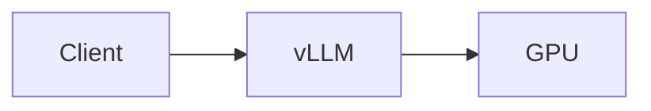

## Problem

State one concrete engineering question.

## Why it matters

Explain the serving or infrastructure consequence.

## Environment

| Component | Value |
|---|---|
| GPU | ... |
| CUDA | ... |
| Driver | ... |
| Python | ... |
| vLLM | ... |
| Model | ... |

## Architecture

## Hypothesis

Write the expectation before presenting results.

## Relevant implementation

Include short excerpts with immutable source links. Do not dump complete files.

## Experiment

Record commands, controls, repetitions, warmups, and measurement definitions.

## Results

Render tables and plots from raw evidence. Do not manually rewrite measurements.

## Interpretation

Separate observation from causal inference.

## What failed

Record failed paths and negative results.

## Limitations

State what the experiment cannot establish.

## Reproduction

Provide exact commands.

## Evidence

Link repository, PR, commit SHA, release, raw JSON/CSV, and logs.

## Next experiment

Name the next falsifiable question.
